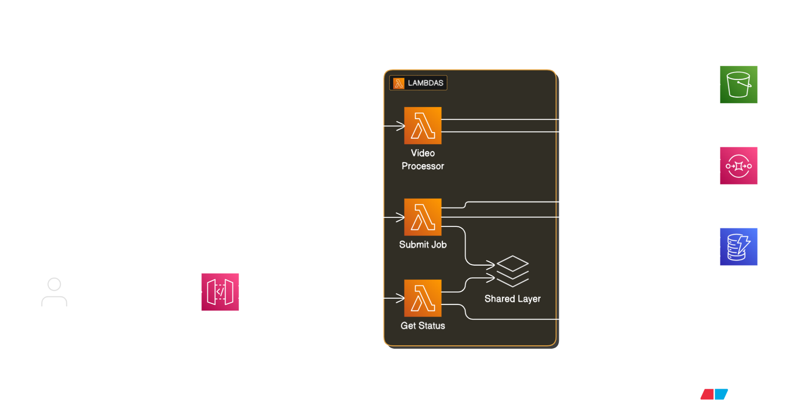

# Auto-Vid: Serverless Video Processing Platform

[](https://www.youtube.com/watch?v=f2SbedesG5Y)

**🎥 [Watch the Demo Video](https://www.youtube.com/watch?v=f2SbedesG5Y)** - See Auto-Vid in action with live AWS Lambda demonstration

A production-ready serverless video enrichment pipeline that uses a declarative JSON format to automatically add AI-powered TTS, music, and sound effects to video.

## ✨ Key Features

- **🎬 Professional Video Processing** - MoviePy-powered video editing with precise timeline control
- **🗣️ AI Text-to-Speech** - AWS Polly with 90+ voices, multiple engines, and SSML support
- **🎵 Smart Audio Mixing** - Background music with crossfading, ducking, and volume control
- **🔔 Webhook Notifications** - Real-time job completion notifications with retry logic
- **☁️ Managed S3 Storage** - Automatic bucket creation with organized asset management
- **📊 Scalable Architecture** - SQS queuing, Lambda concurrency, and retry logic

## 🏗️ Architecture



## 🔧 AWS Lambda Implementation

**AWS Lambda Usage in Auto-Vid:**

**Three Lambda Functions Architecture:**

1. **Submit Job Lambda** (Python Runtime)

   - Validates incoming JSON job specifications using Pydantic models
   - Stores job metadata in DynamoDB with "submitted" status
   - Queues processing jobs to SQS for reliable delivery
   - Returns comprehensive job information via API Gateway

2. **Video Processor Lambda** (Container Runtime)

   - Processes SQS messages containing video job specifications
   - Downloads video/audio assets from S3 to Lambda's /tmp storage
   - Generates AI speech using AWS Polly integration
   - Performs complex video editing with MoviePy (audio mixing, ducking, crossfading)
   - Uploads final processed videos back to S3
   - Generates pre-signed S3 URLs for secure video downloads
   - Updates job status in DynamoDB and sends webhook notifications

3. **Get Status Lambda** (Python Runtime)
   - Retrieves job status and metadata from DynamoDB
   - Returns comprehensive job information via API Gateway

**Lambda Container Benefits:**

- Handles large video processing libraries (MoviePy, FFmpeg)
- Optimized Docker image (360MB) for faster cold starts
- Scales automatically from 0 to hundreds of concurrent video processing jobs
- Pay-per-use model - zero cost when idle, cost-effective at scale

## 🚀 Quick Start

### Prerequisites

- AWS CLI configured with appropriate permissions
- SAM CLI installed
- Python 3.12+
- **Note:** Some AWS accounts have 3GB Lambda memory limits (can be increased via support ticket)

```bash
# Verify your setup
aws sts get-caller-identity
aws polly describe-voices --region us-east-1
```

### Deploy to AWS

```bash
# Clone and deploy
git clone https://github.com/ossamaweb/auto-vid.git
cd auto-vid

sam build # Takes time to build the video processor Docker image
sam deploy --guided
# Answer 'Y' to create managed ECR repositories

# After deployment, sync demo assets to S3
# Replace with your actual S3 bucket from deployment output
BUCKET_NAME="auto-vid-s3-bucket-stack-name-123456789"
aws s3 sync ./media/assets/ s3://$BUCKET_NAME/assets/
aws s3 sync ./media/inputs/ s3://$BUCKET_NAME/inputs/

# Copy the SubmitJobApi and GetStatusApi URLs from the output
```

### Submit Your First Job

```bash
# Replace with your actual API URL from deployment output
API_URL="https://your-api-id.execute-api.us-east-2.amazonaws.com/Prod"

# Submit test job using production sample (replace your-bucket-name with actual bucket)
curl -X POST $API_URL/submit \
  -H "Content-Type: application/json" \
  -d @samples/production/00_api_demo_video.spec.json

# Response: {"jobId": "abc-123-def", "status": "queued"}

# Check status (replace JOB_ID with the actual job ID from above)
curl $API_URL/status/JOB_ID
```

## 📋 Basic Job Format

```json
{
  "jobInfo": {
    "projectId": "api_demo",
    "title": "API Test"
  },
  "assets": {
    "video": {
      "id": "main_video",
      "source": "s3://your-bucket-name/inputs/api_demo_video.mp4"
    },
    "audio": [
      {
        "id": "track",
        "source": "s3://your-bucket-name/assets/music/Alternate - Vibe Tracks.mp3"
      }
    ]
  },
  "backgroundMusic": { "playlist": ["track"] },
  "timeline": [
    {
      "start": 4,
      "type": "tts",
      "data": {
        "text": "Welcome to Auto-Vid! A serverless video enrichment pipeline.",
        "duckingLevel": 0.1
      }
    }
  ],
  "output": {
    "filename": "api_demo_video.mp4"
  }
}
```

## 🛠️ Local Development

```bash
# Setup
cp .env.example .env  # Add your AWS credentials
python3 -m pip install -r requirements.txt

# Test components locally
python3 test_tts_local.py english
python3 test_local.py

# Deploy for full testing (requires AWS)
sam build  # Takes time to build the video processor Docker image
sam deploy --guided
```

### Project Structure

```
├── src/
│   ├── submit_job/           # Job submission API
│   │   ├── app.py           # Lambda handler
│   │   └── requirements.txt
│   ├── get_status/           # Status checking API
│   │   ├── app.py           # Lambda handler
│   │   └── requirements.txt
│   └── video_processor/      # Core video processing
│       ├── app.py            # Lambda handler
│       ├── video_processor.py # Main video processing logic
│       ├── asset_manager.py  # S3 integration
│       ├── tts_generator.py  # AWS Polly integration
│       └── webhook_notifier.py # Webhook notifications
├── layers/shared/            # Shared code between Lambda functions
│   ├── job_spec_models.py    # Pydantic models for job specification
│   ├── job_validator.py      # Validation functions
│   ├── job_manager.py        # DynamoDB operations
│   ├── response_formatter.py # Standardized responses
│   ├── polly_constants.py    # Voice/language definitions
│   └── requirements.txt      # Shared dependencies
├── media/                    # Media files (matches S3 structure)
│   ├── assets/              # Demo audio files (music + sfx)
│   ├── inputs/              # Sample input videos
│   └── outputs/             # Generated videos (gitignored)
├── tmp/                     # Temporary files during processing (gitignored)
├── docs/                     # Documentation
├── samples/            # Example job specifications
├── template.yaml            # SAM infrastructure
├── Dockerfile.videoprocessor # Container definition
├── test_*.py               # Local testing scripts
├── .env.example            # Environment template
└── env.json.example        # Container env template
```

**Notes:**

- Local testing only works for individual components (TTS, video processing, S3 upload and webhooks)
- Full integration testing requires AWS deployment (SQS + DynamoDB)
- SAM handles container build, ECR management, and infrastructure automatically
- Use `sam deploy` for updates after initial guided setup

## ⚠️ Known Issues

### Lambda Memory Limit Error

If deployment fails with `MemorySize value failed to satisfy constraint` for **VideoProcessorFunction**, your account has a 3GB Lambda memory limit.

**Solutions:**

- **Request quota increase** via AWS Support Console (they'll raise it to 10GB)
- **Try a different region** (some regions may have higher limits available)
- **Accept current 3008 MB limit** (reduced performance but functional)

## 🧹 Cleanup

```bash
# Delete the entire stack and all resources (replace with your actual stack name)
aws cloudformation delete-stack --stack-name <your-stack-name>

# Wait for deletion to complete
aws cloudformation wait stack-delete-complete --stack-name <your-stack-name>

# Verify deletion
aws cloudformation describe-stacks --stack-name <your-stack-name>
# Should return: "Stack with id <stack-name> does not exist"
```

## 📚 Documentation

- **[API Reference](docs/API.md)** - REST API endpoints and responses
- **[Complete Job Schema](docs/SCHEMA.md)** - Job specification format
- **[Business Use Cases](docs/BUSINESS.md)** - Real-world applications
- **[Architecture Details](docs/ARCHITECTURE.md)** - Technical deep dive
- **[Sample Job Specifications](samples/)** - Example specs for local and production
- **[All Documentation](docs/)** - Complete documentation index

## ⚠️ Cost Warning

This application will incur AWS charges. Monitor your billing dashboard and use the cleanup command when done.

---

Built for the **AWS Lambda Hackathon** - demonstrating enterprise-grade serverless video processing! 🚀
